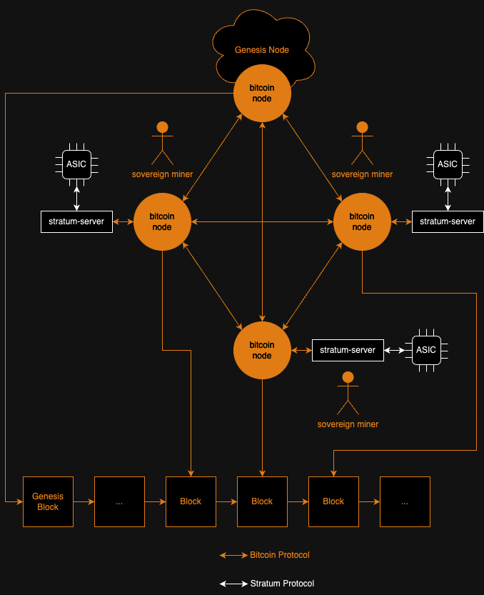
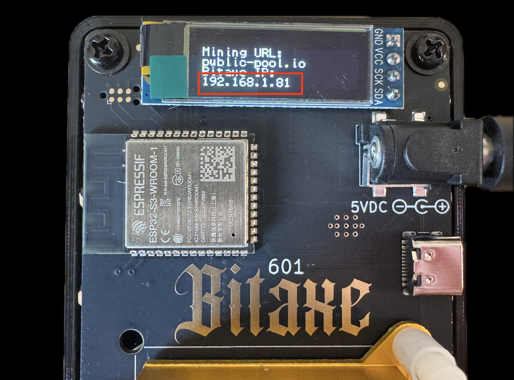

# bitaxe hashwar
# a beginner guide to sovereign bitcoin mining


---

# goals

- intro to [bitaxe](https://bitaxe.org/)
- become a sovereign node runner
- become a sovereign miner

---



---

# prerequisites

- laptop with WiFi
- linux environment
- familiarity with command line
- basic english
- wish to become a sovereign miner

---

# wifi

- SSID: `todo`
- password: `todo`

---

# slides

## `185.130.45.51:1337/html/plebnet-workshop.html`

---

# linux

you will need a ⚠ **linux environment** ⚠

options:
- native
- VM

if you choose a VM, make sure it has:
- ⚠️ **bridged network** ⚠️ (VM has IP on WiFi network)
- at least 4 CPU cores
- at least 4GB RAM

---

# `plebnet`

this workshop uses a custom `signet` (`plebnet`) for the following reasons:

- we want a confined hashrate environment.
- `mainnet`, `testnet3`, `testnet4` and the public `signet` don't fill our needs.
- `regtest` is too isolated and requires manual block generation, which is not practical for a mining workshop.

`plebnet` is a custom signet that does not require coinbase signatures.

the genesis node can be found at `185.130.45.51`.

---

# clone workshop repo

```shell
$ git clone https://github.com/plebhash/plebnet-workshop
$ cd plebnet-workshop
```

---

# bootstrap `bitcoind`

```shell
$ ./bootstrap_bitcoind.sh 
```

this script will:
- fetch and unpack a tarball from the official bitcoin core distribution pipeline (todo: checksum)
- start a `bitcoin_datadir` for `plebnet` (with a snapshot of the latest live deployment to accelerate IBD)

---

# add peers to `bitcoin.conf`

- ask the LAN IP address of other workshop participants
- add the LAN IP to the `addnode` fields of `bitcoin_datadir/bitcoin.conf`
```
[signet]
server=1
rpcuser=user
rpcpassword=pass
# OP_TRUE
signetchallenge=51
addnode=185.130.45.51 # genesis node
# addnode=fixme
# addnode=fixme
# addnode=fixme
```

---

# connect to `plebnet`

```shell
$ source env.sh
$ btcd
```

these commands will:
- load some shell variables + alias
- connect your bitcoin node to `plebnet`

---

# create a wallet

open a new terminal (since the other one is running `bitcoind`) and run:

```shell
$ source env.sh
$ btc createnewwallet mywallet
$ btc getnewaddress
```

these commands will:
- load some shell variables + alias
- create a new wallet on your `bitcoin_datadir`
- get a new address on this wallet

---

# bootstrap `stratum-server`

```shell
$ ./bootstrap_stratum_server.sh
```

this script will fetch a stratum server

---

# configure `stratum-server`

```shell
$ nano stratum-server/stratum-server.conf 
```

edit the following fields of the configuration file:
- `btcaddress`: copy-paste the address of the wallet step
- `btcsig`: write a custom tag for the blocks you mine

---

# start `stratum-server`

```shell
$ source env.sh
$ stratum-server
```

these commands will:
- load some shell environment variables + alias
- start `stratum-server`

---
# power bitaxe

- Plug the included 5V 5A power supply into wall outlet
- Attach the 5V barrel plug into the Bitaxe


---
# setup bitaxe

- using your phone or a laptop, join the Bitaxe setup SSID shown on the display. in this case; `Bitaxe_6E71`


---
# config bitaxe

- After your phone connects to the Bitaxe setup wifi, you should see a "captive portal" appear. If not, open a browser and go to `http://192.168.4.1`
- Open the hamburger menu in the upper right and open the Network tab


---
# config bitaxe

- Enter the conference WiFi name and password **exactly**
- click `Save`


---
# config bitaxe

- Go back to the hamburger menu. Click on `Restart` at the bottom


---

# configure bitaxe mining

- after the Bitaxe restarts it will show an IP address on the screen. Make sure your computer is back on conference wifi, and open this IP in your browser.



---

# configure bitaxe mining

- open the hamburger menu (if not already open) and click on the settings tab


---

# configure bitaxe mining

- Enter the workshop stratum details


---

# configure bitaxe mining

- click `save`


---

# configure bitaxe mining

- click `restart`


---

# watch block explorer

# `plebnet.jaonoctus.dev`

---

# industrial mining

# 👷
# 🏭🏭
# 📟📟📟
# ⚡⚡⚡⚡

---

# Q&A 

---

# thank you
